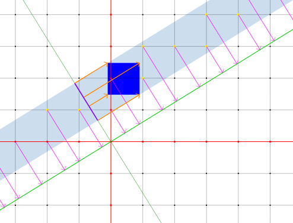

# Shadows from a higher dimension

A visualization of tilings as projections from a higher dimensional integer lattice!

## Explanation

A pattern of tiling can be seen as a projection of a slice of a tiling in a higher dimension. Especially interesting is how aperiodic tilings can be seen as a projection of a slice of a periodic tiling in a higher dimension.

If the slope or gradient of the projection plane is rational, it may be written as a fraction, the rise over the run. The rise over the run ultimately describes which nodes on the higher dimensional integer lattice the plane intersects. Tilings generated from rational slopes are periodic, because the pattern repeats between the cast shadows of ever intersecting node.

If the slope is irrational, then it doesn't intersect any node other than the origin, and this means the resulting tiling is aperiodic.

The blue square (the "unit hypercube") is used to isolate the slice of the lattice that is projected. The position of the unit hypercube acts as the seed that determines which (of infinitely many, in the case of aperiodic tilings) variation of possible tilings is cast.

I made this visualizer for the case of a 1D tiling projected from a 2d lattice to help understand the basic relationships before considering higher dimensional cases, in particular, the Penrose tilings, which can be seen as 2D shadows from a 5D lattice.

## Controls

- Left click and drag to move the unit hypercube.
- Middle click and drag to pan the camera.
- Middle click and drag while holding shift to rotate the camera.
- Right click and drag to set the slope of the line.
